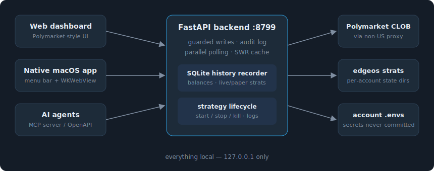

# Polymarket Control Panel

A local, Polymarket-styled control panel for managing multiple Polymarket trading accounts and automated strategies — with live balance charts, strategy history, an agent-ready HTTP API, and an MCP server so AI assistants can operate it safely.

Everything runs on `127.0.0.1`. Nothing leaves your machine except the trading calls themselves.



## What you get

**Native macOS app** (`native/PolyPanel.app`) — the primary UI. Fully native SwiftUI with Swift Charts, Polymarket-style dark theme, menu-bar extra with live balance + portfolio sparkline, and backend auto-start. Same five tabs as the web dashboard below, plus native confirm dialogs for every real-money action.

**Web dashboard** (`http://127.0.0.1:8799`) — the same UI in the browser (also what remote/AI tooling can screenshot):

- **Portfolio** — total value with 1H/6H/1D/1W/1M/ALL history chart and 24h change, per-account cards with balance sparklines, positions, open orders, running-strategy chips, and a per-account kill switch
- **Strategies** — catalog with parameter forms, exact command preview, paper/LIVE start (LIVE requires an explicit confirm), running list with stop/kill
- **Markets** — search active markets, view order books
- **Logs / Audit** — strategy log tails and the append-only audit trail of every state-changing action

**History** — a background recorder snapshots balances, positions, and live/paper strategy counts into SQLite every 60s; all charts are backed by `/api/history/*`.

**Speed** — parallel account polling, stale-while-revalidate caching (dashboard polls are served instantly from cache while refreshing in the background), and a startup warmup thread so the first poll isn't a 40s cold start.

## Safety model

- Every write defaults to `dryRun=true` (returns the exact command / notional without acting)
- Live actions additionally require `confirm=true` — otherwise HTTP 428
- Every state-changing call is appended to an audit log
- Secrets live in per-account `.env` files referenced by path; they are never committed, never serialized to the API

## Setup

```bash
git clone <this repo>
cd polymarket-control-panel
cp config/accounts.example.json config/accounts.json   # add your accounts
cp config/panel.example.env config/panel.env           # add your paths
./start.sh                # backend + native macOS app (builds it on first run)
./start.sh --web          # backend + dashboard in browser
```

The panel reuses an existing trading stack rather than re-implementing order signing:

- `EDGEOS_PYBIN` — a python with `py_clob_client_v2` installed (your trading venv). Without it the panel still runs read-only for markets and serves the dashboard.
- `EDGEOS_REPO` — the edgeos strategy repo, needed to launch/track strategies. Without it the Strategies tab is read-only.
- `WEBSHARE_DIR` — a directory containing `webshare.py` + `.env` with `WEBSHARE_TOKEN` for non-US egress (Polymarket geoblocks US order posts). Or pin `PANEL_PROXY=http://…` directly.

## AI agents

Two equivalent surfaces:

**HTTP API** — full OpenAPI schema at `/openapi.json`, human docs at `/docs`, and a capability summary at `/api/agent/manifest`. Point any tool-using agent at `http://127.0.0.1:8799`.

**MCP server** (`mcp-server/panel_mcp.py`) — 16 tools over stdio. Claude Desktop / Claude Code config:

```json
{
  "mcpServers": {
    "polymarket-panel": {
      "command": "python3",
      "args": ["/path/to/polymarket-control-panel/mcp-server/panel_mcp.py"],
      "env": { "PANEL_URL": "http://127.0.0.1:8799" }
    }
  }
}
```

Or with Claude Code: `claude mcp add polymarket-panel -- python3 /path/to/mcp-server/panel_mcp.py`

Reads (`list_accounts`, `balance_history`, `running_strategies`, `search_markets`, …) are safe to call freely. Writes (`start_strategy`, `place_order`, `kill_switch`, …) default to dry-run and are blocked server-side without `confirm=true`, so an agent can never act without the guard even if prompted to.

## Tests

```bash
scripts/test-all.sh          # everything (backend + native), same as CI
cd backend && python3 -m pytest tests -q    # backend only
cd native && swift test                      # native app only
```

No network, no credentials, no trading venv required for any of it:

- **Backend unit/API (pytest)** — API contract, write guards (428s), tolerant multi-format `.env` cred loader, history recording/downsampling, per-bot series, launch-command parsing, cache semantics, parallel-polling speed, MCP tool surface.
- **Backend E2E (pytest)** — boots the real uvicorn process on a free port with a throwaway config and verifies health, dashboard, OpenAPI surface, graceful no-creds degradation, and write guards over actual HTTP.
- **Dashboard (pytest + node)** — inline JS must parse, and every `/api/...` path the dashboard calls must exist in the OpenAPI schema.
- **Native app (XCTest)** — tolerant model decoding (numbers-as-strings), window-end parsing from market slugs, ISO/date-only fallbacks, param importance ordering, duration formatting, and position urgency sorting.

CI runs the backend suite on ubuntu and the Swift suite on macos-14 for every push and PR.

## Layout

```
backend/          FastAPI :8799 — API + dashboard + history recorder
  server.py       routes (guarded writes, history, agent manifest)
  config.py       account registry + tolerant .env cred loader
  clients.py      per-account authenticated CLOB reads/writes
  strats.py       strategy catalog + start/stop/running-state
  history.py      SQLite time-series recorder + chart queries
  cache.py        TTL + stale-while-revalidate cache
  static/         Polymarket-style dashboard (zero JS dependencies)
  tests/          pytest suite (mocked, CI-safe)
mcp-server/       MCP stdio server exposing the API as agent tools
native/           native SwiftUI app (Swift Charts, menu-bar extra) — primary UI
config/           accounts.json + panel.env (gitignored; examples provided)
```

## Disclaimer

This is a personal trading tool. Real-money actions are gated but still real — watch the first live start/stop of any strategy. Nothing here is financial advice; trade at your own risk.
